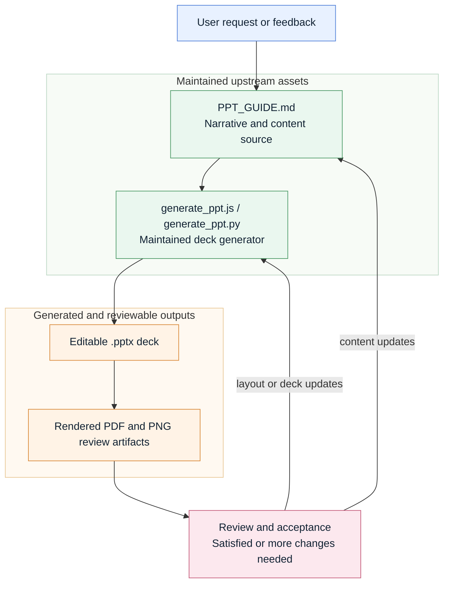

# deck-workflow-skill

[中文说明 / Chinese README](./README_zh.md)

`deck-workflow-skill` is a repository for an agent skill that treats presentation work as an iterative production loop instead of a one-shot deck export. The skill works with both OpenAI Codex (`$deck-workflow`) and Anthropic Claude Code (`/deck-workflow`, or auto-triggered from the `description` in `SKILL.md`).

The installable skill lives in [`deck-workflow/`](./deck-workflow). The repository adds repo-level documentation, maintenance guidance, and version control around that skill.

## What This Skill Is For

Use this skill when deck work needs to stay editable and reviewable across multiple rounds:

- New presentation creation
- Existing deck restructuring
- Human feedback driven revisions
- Repeated visual QA and incremental fixes
- Workflows that benefit from separating content intent from implementation

The core idea is a standard loop:

1. Write `PPT_GUIDE.md` first.
2. Implement the deck in a generation script.
3. Generate the editable `.pptx`.
4. Render and review the result visually.
5. Route content changes back into the guide and layout or deck implementation changes back into the generator.
6. Rebuild and rerender until the main issues are closed.

## How It Works

This skill is designed as a self-iterating automation loop rather than a one-shot export. `PPT_GUIDE.md` acts as the maintained source of truth for storyline, slide responsibilities, visible text, formula decisions, and speaker notes, while `generate_ppt.js` or `generate_ppt.py` acts as the maintained implementation layer that turns that plan into an editable deck.

The review point is acceptance-driven: if the rendered deck is satisfactory, the maintained guide, generator, and `.pptx` become the next baseline; if more work is needed, content changes route back to `PPT_GUIDE.md`, while layout, rendering, asset placement, or deck implementation changes route back to the generator. Because those upstream files stay in the repo and are revised over time, new feedback can be handled as another incremental pass instead of a restart.



In practice, the persistent pair of `PPT_GUIDE.md` plus the generator is what makes continuous incremental updates possible. The guide prevents narrative, formula, and notes drift; the generator prevents layout and rendering drift; and the render/review loop turns each future request into a targeted upstream edit instead of a fragile rewrite.

## Repository Layout

```text
.
├── AGENTS.md
├── CLAUDE.md -> AGENTS.md        # symlink, so both agents see the same project instruction
├── LICENSE
├── README.md
├── README_zh.md
└── deck-workflow/                # installable skill directory
    ├── SKILL.md                  # skill body both Codex and Claude Code load
    ├── agents/openai.yaml        # Codex-only UI metadata; Claude Code ignores it
    ├── references/
    └── scripts/
```

## Skill Highlights

- A guide-first workflow for decks that will be revised more than once
- Explicit change routing between `PPT_GUIDE.md` and `generate_ppt.*`
- A review loop based on rendered output rather than source inspection alone
- A helper script that scaffolds a new deck workspace
- Backend-specific guidance for both JavaScript and Python generators
- An explicit rule that code snippets, inline code labels, and terminal-style text should use monospaced fonts
- Explicit workflow rules for important formulas: when they belong on-screen, how to explain symbols, and how to review render risks
- Explicit workflow rules for speaker-note delivery: guide-backed notes, final-deck persistence checks, and notes/guide alignment
- A dedicated text-overflow triage reference covering the high-risk component catalog, failure definitions, and the "remove presenter cues -> shorten copy -> widen container -> rework layout -> shrink only as last resort -> split" ladder
- A delivery checklist that distinguishes the post-notes `.pptx` as the only acceptable handoff artifact and requires a self-review before the user sees the deck
- A `validate_deck.py` helper that cross-checks slide count, notes persistence, empty-notes, and visible slide-id leakage
- Rules that keep internal slide ids such as `s01-cover` in source and review artifacts instead of visible slide text
- A helper script that renders `.pptx -> PDF -> PNG` review artifacts
- Design guidance for common deck categories such as project updates, paper readings, training, board reviews, proposals, sales decks, investor pitches, and postmortems

## Quick Start

Validate the skill:

```bash
python /home/hansbug/.codex/skills/.system/skill-creator/scripts/quick_validate.py ./deck-workflow
```

Create a starter deck workspace:

```bash
python ./deck-workflow/scripts/init_deck_workspace.py ./tmp/example-deck \
  --title "Quarterly Business Review" \
  --author "HansBug" \
  --audience "Leadership team" \
  --duration-minutes 15 \
  --slides 12
```

Create a Python-based starter deck workspace:

```bash
python ./deck-workflow/scripts/init_deck_workspace.py ./tmp/example-deck-python \
  --title "Quarterly Business Review" \
  --author "HansBug" \
  --audience "Leadership team" \
  --duration-minutes 15 \
  --slides 12 \
  --backend python
```

Prepare a local Python environment before deciding that Python is unavailable:

```bash
python3 -m venv ./tmp/example-deck-python/.venv
source ./tmp/example-deck-python/.venv/bin/activate
pip install -r ./tmp/example-deck-python/requirements.txt
```

Detect which backend and review tools are available:

```bash
python ./deck-workflow/scripts/detect_deck_environment.py
```

Render a deck into reviewable PDF/PNG artifacts:

```bash
python ./deck-workflow/scripts/render_review.py ./tmp/example-deck/deck.pptx --output-dir ./tmp/example-deck/rendered
```

Validate a finished deck before handoff:

```bash
python ./deck-workflow/scripts/validate_deck.py ./tmp/example-deck/deck.pptx \
  --guide ./tmp/example-deck/PPT_GUIDE.md \
  --expect-notes \
  --expect-slides 12
```

## Backend Policy

- Prefer Python first when the repo and environment support it.
- If Python deck packages are missing, first try a workspace-local `venv` and install `requirements.txt`.
- Fall back to JavaScript only when Python is still not practical or when you want to align with the official `$slides` skill.
- If both are unsuitable, preserve the same guide-first workflow in another stable format rather than abandoning the workflow.

## Audience-Facing Rule

- Stable slide ids such as `s01-cover` are for guides, code, review notes, and commit history.
- Do not place those ids on visible slides unless the user explicitly requests them.
- Render code snippets, inline code labels, shell commands, and similar code-like visible text in a monospaced font by default.
- When formulas are central to the slide's argument, keep them visible and explain the key symbols for the audience.
- If the final deck must be speakable, keep speaker notes in sync with `PPT_GUIDE.md` and verify that the exported `.pptx` actually contains them.

## Notes On Persistence

The deck workspace should live inside the user's repo or another durable project directory.
Do not keep `PPT_GUIDE.md`, `generate_ppt.*`, and `deck.pptx` only in transient agent directories if the deck is expected to be revised later.

## Recommended Pairing

This skill works well together with the official OpenAI `$slides` skill:

- Use `$deck-workflow` for the high-level production contract, guide writing, change routing, and review loop.
- Use `$slides` for low-level PptxGenJS helpers, rendering utilities, and deck validation when available.

## Installation

### Codex CLI

```bash
cp -R ./deck-workflow "${CODEX_HOME:-$HOME/.codex}/skills/"
```

Or, to keep a single working copy the skill directory just points at:

```bash
ln -s "$(pwd)/deck-workflow" "${CODEX_HOME:-$HOME/.codex}/skills/deck-workflow"
```

Invoke it explicitly as `$deck-workflow`.

### Claude Code

```bash
cp -R ./deck-workflow "${CLAUDE_CONFIG_DIR:-$HOME/.claude}/skills/"
```

Or with a symlink:

```bash
ln -s "$(pwd)/deck-workflow" "${CLAUDE_CONFIG_DIR:-$HOME/.claude}/skills/deck-workflow"
```

Invoke it explicitly as `/deck-workflow`, or let Claude Code auto-trigger it from the `description` in `SKILL.md`.

### Shared Install (Both)

Clone once and symlink `deck-workflow/` into each CLI's skills directory:

```bash
git clone https://github.com/HansBug/deck-workflow-skill ~/src/deck-workflow-skill
ln -s ~/src/deck-workflow-skill/deck-workflow "${CODEX_HOME:-$HOME/.codex}/skills/deck-workflow"
ln -s ~/src/deck-workflow-skill/deck-workflow "${CLAUDE_CONFIG_DIR:-$HOME/.claude}/skills/deck-workflow"
```

## License

This repository is licensed under the MIT License. See [`LICENSE`](./LICENSE).
