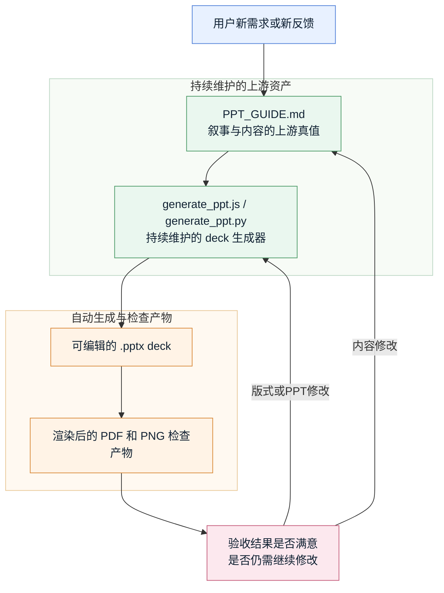

# deck-workflow-skill

[English README](./README.md)

`deck-workflow-skill` 是一个 agent skill 的源码仓库，同时兼容 OpenAI Codex（`$deck-workflow`）和 Anthropic Claude Code（`/deck-workflow`，或由 `SKILL.md` 的 `description` 自动触发）。它的目标不是“一次性生成一个 PPT”，而是把 PPT 制作变成一条可反复迭代的生产流程。

真正可安装的 skill 位于 [`deck-workflow/`](./deck-workflow)。仓库根目录补充了 repo 级说明、维护约定和版本管理文件。

## 这个 Skill 解决什么问题

适用于下面这类需要持续迭代的 deck 工作：

- 新建一套演示文稿
- 重构已有 deck 的结构和叙事
- 根据人类反馈做多轮修改
- 反复进行视觉验收和增量修复
- 希望把“内容意图”和“实现代码”拆开维护的场景

这套 skill 的核心工作流是一个标准闭环：

1. 先写 `PPT_GUIDE.md`
2. 再写 `generate_ppt.*`
3. 生成可编辑的 `.pptx`
4. 把结果渲染出来做视觉检查
5. 后续修改时，内容类修改回到 guide，版式或 PPT 实现类修改回到 generator
6. 重新生成并复检，直到主要问题关闭

## 工作方式

这个 skill 的设计目标不是“一次生成完就结束”，而是形成一条可自迭代的自动化闭环。`PPT_GUIDE.md` 作为持续维护的上游真值，负责承载叙事主线、页面职责、可见文案、公式口径和 notes 口径；`generate_ppt.js` 或 `generate_ppt.py` 作为持续维护的实现层，负责把这份规范稳定地落成可编辑 deck。

闭环的路由点是验收结果：如果渲染后的 deck 已经满意，当前 `PPT_GUIDE.md`、generator 和 `.pptx` 就成为下一轮工作的基线；如果仍需继续修改，内容、叙事、notes、公式口径类问题回到 `PPT_GUIDE.md`，页面布局、渲染、素材摆放或 PPT 实现类问题回到 generator。也正因为这些上游文件会被长期保存在 repo 里并持续更新，后续反馈才可以作为增量迭代处理，而不是每次推倒重来。



真正让持续增量更新成为可能的，不是单次生成出来的 `.pptx`，而是 `PPT_GUIDE.md` 和 generator 这对可持续维护的上游资产。guide 用来防止叙事、公式和 notes 漂移，generator 用来防止版式与渲染实现漂移，而渲染与复检闭环则把每一次新需求都变成一次可控的上游增量修改。

## 仓库结构

```text
.
├── AGENTS.md
├── CLAUDE.md -> AGENTS.md        # symlink，两端读到同一份项目说明
├── LICENSE
├── README.md
├── README_zh.md
└── deck-workflow/                # 可安装的 skill 目录
    ├── SKILL.md                  # Codex 与 Claude Code 都会加载的 skill 正文
    ├── agents/openai.yaml        # Codex 专属 UI 元数据；Claude Code 会忽略
    ├── references/
    └── scripts/
```

## Skill 能力

- 面向多轮迭代的 guide-first deck 工作流
- 明确区分 `PPT_GUIDE.md` 和 `generate_ppt.*` 的职责
- 基于渲染结果而不是仅看源码的 review loop
- 提供一个脚手架脚本，用于初始化新的 deck 工作区
- 同时给出 JavaScript 和 Python 两类 generator 的制作规范
- 明确要求代码片段、行内代码标签、终端命令等代码相关可见文本默认使用等宽字体
- 明确补充了重要公式的工作流规范：什么时候必须上屏、如何解释符号、以及如何做渲染验收
- 明确补充了 speaker notes 交付规范：notes 以 guide 为准、最终 `.pptx` 必须真正写入 notes、并且要校验和 guide 一致
- 明确要求像 `s01-cover` 这样的 slide id 只用于源码和 review，不应直接出现在观众可见页面里
- 提供一个稳定的 `pptx -> pdf -> png` 视觉检查脚本
- 补充了项目汇报、paper reading、培训、board review、proposal、sales、investor pitch、postmortem 等常见 deck 类型的制作要点

## 快速开始

校验 skill 结构：

```bash
python /home/hansbug/.codex/skills/.system/skill-creator/scripts/quick_validate.py ./deck-workflow
```

初始化一个新的 deck 工作区：

```bash
python ./deck-workflow/scripts/init_deck_workspace.py ./tmp/example-deck \
  --title "Quarterly Business Review" \
  --author "HansBug" \
  --audience "Leadership team" \
  --duration-minutes 15 \
  --slides 12
```

初始化一个 Python 后端的 deck 工作区：

```bash
python ./deck-workflow/scripts/init_deck_workspace.py ./tmp/example-deck-python \
  --title "Quarterly Business Review" \
  --author "HansBug" \
  --audience "Leadership team" \
  --duration-minutes 15 \
  --slides 12 \
  --backend python
```

如果当前 Python 缺少 deck 依赖，先尝试在工作区里准备本地虚拟环境：

```bash
python3 -m venv ./tmp/example-deck-python/.venv
source ./tmp/example-deck-python/.venv/bin/activate
pip install -r ./tmp/example-deck-python/requirements.txt
```

检测当前环境里有哪些后端和 review 工具：

```bash
python ./deck-workflow/scripts/detect_deck_environment.py
```

把 deck 渲染成可供视觉检查的 PDF / PNG：

```bash
python ./deck-workflow/scripts/render_review.py ./tmp/example-deck/deck.pptx --output-dir ./tmp/example-deck/rendered
```

## Backend 策略

- 默认优先 Python。
- 如果缺的是 Python 依赖，先尝试工作区本地 `venv` 和 `requirements.txt`，不要一看到 import 缺失就直接退到 JavaScript。
- 如果 Python 路径仍然不现实，再退到 JavaScript。
- 如果两者都不合适，也应该保留同样的 guide-first 工作流，而不是直接丢掉上游规范。

## 面向观众的内容规则

- `s01-cover` 这类稳定 slide id 只用于 guide、代码、review note 和提交记录。
- 除非用户明确要求，否则不要把这些内部 id 直接放到页面可见区。
- 代码片段、行内代码标签、终端命令等代码相关可见文本默认应使用等宽字体。
- 如果公式承载页面主论点，默认应真正上屏，并给出面向观众的符号解释。
- 如果最终 deck 需要可直接照念，必须让 speaker notes 和 `PPT_GUIDE.md` 同步，并确认导出的 `.pptx` 里真的带有 notes。

## 持久化要求

deck 工作区应放在用户自己的 repo 或其他持久目录里。
如果后续还要继续改，就不要把 `PPT_GUIDE.md`、`generate_ppt.*` 和 `deck.pptx` 只放在临时 agent 目录里。

## 推荐搭配

这个 skill 很适合和 OpenAI 官方 `$slides` skill 配合使用：

- `$deck-workflow` 负责高层流程、guide、改动路由和 review 闭环
- `$slides` 负责底层 PptxGenJS helper、render 工具和 deck 校验

## 安装方式

### Codex CLI

```bash
cp -R ./deck-workflow "${CODEX_HOME:-$HOME/.codex}/skills/"
```

或者维持一份工作副本，用 symlink 指过去：

```bash
ln -s "$(pwd)/deck-workflow" "${CODEX_HOME:-$HOME/.codex}/skills/deck-workflow"
```

安装后通过 `$deck-workflow` 显式调用。

### Claude Code

```bash
cp -R ./deck-workflow "${CLAUDE_CONFIG_DIR:-$HOME/.claude}/skills/"
```

或者用 symlink：

```bash
ln -s "$(pwd)/deck-workflow" "${CLAUDE_CONFIG_DIR:-$HOME/.claude}/skills/deck-workflow"
```

安装后通过 `/deck-workflow` 显式调用，或者依赖 `SKILL.md` 的 `description` 自动触发。

### 同时装到两边

clone 一份仓库，然后把 `deck-workflow/` symlink 到两个 CLI 的 skills 目录：

```bash
git clone https://github.com/HansBug/deck-workflow-skill ~/src/deck-workflow-skill
ln -s ~/src/deck-workflow-skill/deck-workflow "${CODEX_HOME:-$HOME/.codex}/skills/deck-workflow"
ln -s ~/src/deck-workflow-skill/deck-workflow "${CLAUDE_CONFIG_DIR:-$HOME/.claude}/skills/deck-workflow"
```

## 许可证

本仓库使用 MIT License，详见 [`LICENSE`](./LICENSE)。
